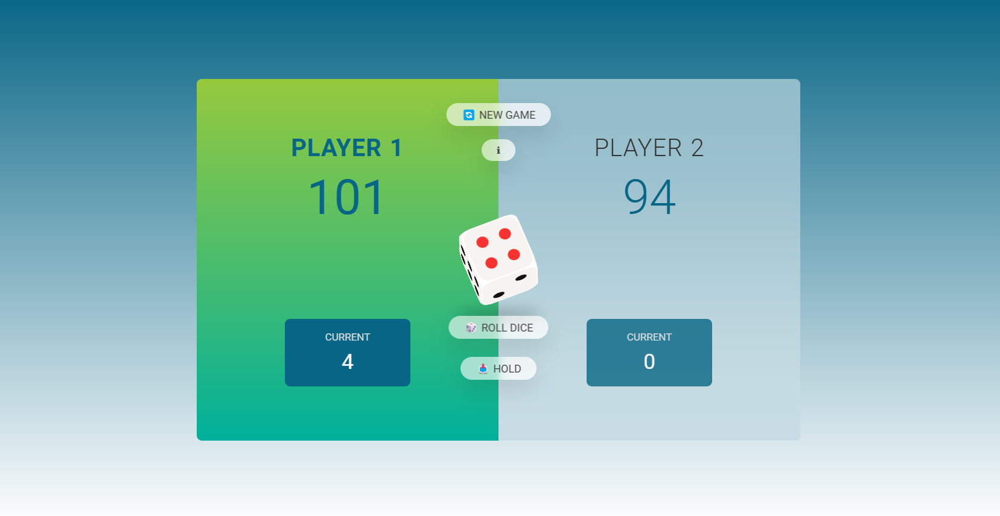

## Acknowledgments:

I've used and modified the 3d rolling dice from the below codpen source

A Pen created on CodePen.io. Original URL: [https://codepen.io/jico/pen/wvMpgog](https://codepen.io/jico/pen/wvMpgog).

I have used the body background gradient from this URL: [https://uigradients.com/#Sky](https://uigradients.com/#Sky)

# Pig Game - A Dice Game 🎲

Welcome to the **Pig Game**! This is a classic two-player dice game built using JavaScript, HTML, and CSS.

## 🎮 Game Rules
- Players take turns rolling a dice.
- The player’s score for that turn is added to their total score until they roll a `1`.
- If a `1` is rolled, the player loses their current score for that turn and it becomes the other player's turn.
- The first player to reach or exceed the target score (usually 100) wins the game.

## 📝 Features
- **Two-player mode:** Alternate turns for two players.
- **Dynamic scoring:** Real-time score updates based on dice rolls.
- **Hold Option:** Players can choose to hold their score, passing the turn to the other player.
- **Winner Announcement:** Automatic game reset when a player wins.

## 📂 Project Structure
The repository is organized as follows:
- `index.html`: The main HTML file.
- `style.css`: The CSS file for styling.
- `script.js`: JavaScript logic for the game mechanics.

## 🚀 Getting Started

1. **Clone the repository:**
   ```bash
   git clone https://github.com/SG75/pig_game_a_Dice-Game.git
2.Navigate to the project directory:
  cd pig_game_a_Dice-Game
3. Open index.html in your browser to play the game.

Screenshot


Demo: [Pig Game](https://enchanting-profiterole-72048e.netlify.app/)
